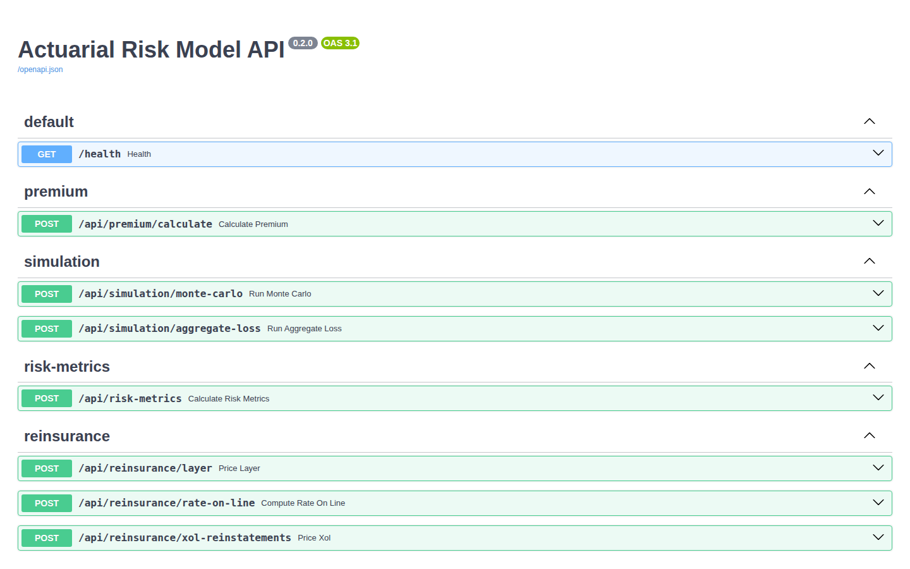
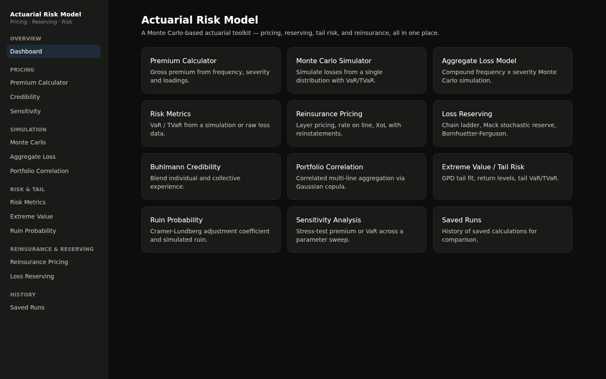
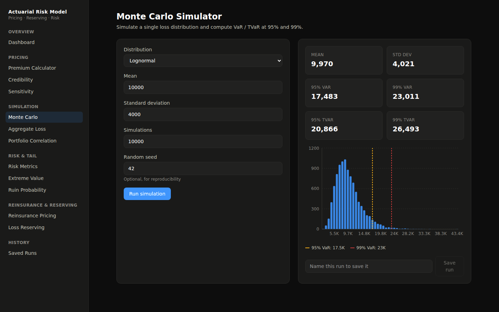
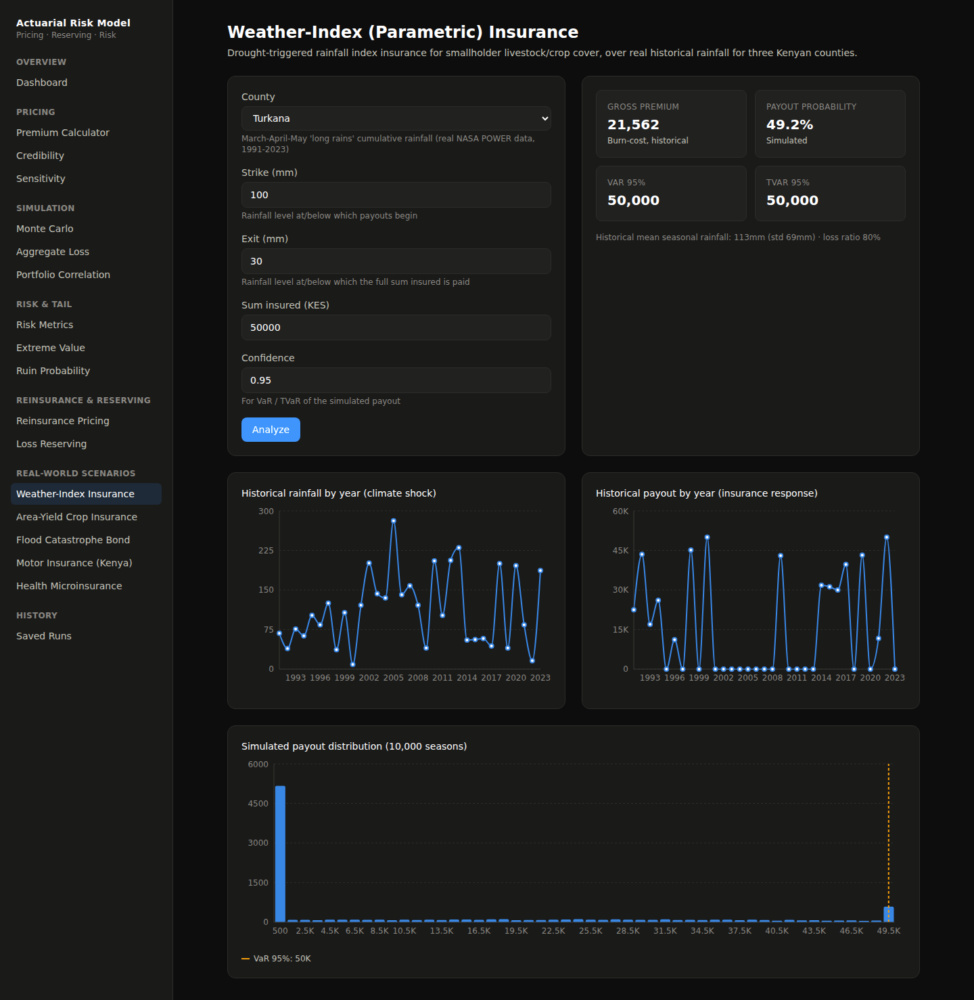

<div align="center">

# 📊 Actuarial Risk Model

**A Python actuarial toolkit for pricing, reserving, and tail-risk modeling — with a FastAPI layer for the [companion React frontend](https://github.com/JessyWaweru/actuarial_risk_model_frontend).**

[](https://www.python.org/)
[](https://fastapi.tiangolo.com/)
[](https://numpy.org/)
[](https://scipy.org/)
[](https://docs.pytest.org/)
[](LICENSE)

</div>

---

## 🌐 Overview

A Monte Carlo–driven actuarial risk modeling toolkit covering the core lifecycle of P&C pricing and reserving: simulate loss distributions, price premiums and reinsurance layers, estimate reserves, quantify tail risk, and blend experience with credibility theory — from the CLI, a REST API, or as a library.

## ✨ Features

| Area | What it does |
|---|---|
| 🎲 **Monte Carlo Engine** | Simulate 10,000+ loss scenarios from normal, Poisson, lognormal, or gamma distributions |
| 📦 **Aggregate Loss Model** | Compound frequency × severity simulation — the standard collective risk model |
| 💰 **Premium Calculator** | Gross premium from frequency, severity, risk loading, and expense loading |
| 📉 **Risk Metrics** | Value-at-Risk and Tail VaR at 95%/99% confidence, from simulation or raw loss data |
| 🛡️ **Reinsurance Pricing** | Excess-of-loss layer pricing, rate on line, and reinstatement premiums |
| 📈 **Loss Reserving** | Deterministic chain ladder, Mack's stochastic chain ladder (with standard error), Bornhuetter-Ferguson |
| 🧮 **Buhlmann Credibility** | Blend individual risk experience with the collective mean via credibility factor Z |
| 🕸️ **Portfolio Correlation** | Multi-line aggregation via Gaussian copula, quantifying real diversification benefit |
| ⚡ **Extreme Value Theory** | Peaks-over-threshold tail fitting with the Generalized Pareto Distribution |
| 🌊 **Ruin Theory** | Cramér-Lundberg surplus process, adjustment coefficient, and ruin probability |
| 🎚️ **Sensitivity Analysis** | Generic parameter-sweep stress testing over any calculation |
| 🔌 **REST API** | FastAPI layer exposing every model, with run history persisted via SQLAlchemy |

## 🌍 Real-World Scenarios

Five scenario modules built on the core toolkit above, each priced over **real public data**, not synthetic placeholders (except where noted):

| Scenario | Mechanism | Real data source |
|---|---|---|
| 🌧️ **Weather-Index Insurance** | Drought-triggered payout when seasonal rainfall falls below a strike level, for Homa Bay, West Pokot, and Turkana counties | NASA POWER, monthly rainfall 1991-2023 |
| 🌾 **Area-Yield Crop Insurance** | Payout when a region's average yield falls below a guaranteed fraction of its trend yield | World Bank Open Data, Kenya cereal yield 1961-2023 |
| 🌊 **Flood Catastrophe Bond** | EVT-driven cat bond pricing (reuses the extreme value module) over rainfall extremes as a flood-severity proxy | NASA POWER, daily rainfall for the Tana River basin (Garissa), 2001-2023 |
| 🚗 **Motor Insurance (Kenya)** | Frequency/severity pricing by vehicle class with a bonus-malus no-claims discount (reuses the aggregate loss model) | Illustrative, calibrated to documented industry claim patterns — noted in the module docstring |
| 🏥 **Health Microinsurance** | IBNR reserving (reuses Mack's chain ladder) plus catastrophic/stop-loss cover pricing (reuses the reinsurance layer formula) | Illustrative, calibrated to typical scheme scale — noted in the module docstring |

Raw data pulls and the conversion script live in `data/`, so every number is reproducible from source.

## 📸 Screenshots

<div align="center">

**Interactive API docs (Swagger UI)**


**Companion frontend — dashboard**


**Companion frontend — Monte Carlo simulator**


**Companion frontend — weather-index insurance (climate shock → payout)**


</div>

## 🗂️ Project structure

```
data/
├── climate/                # NASA POWER rainfall pulls (raw JSON + converted CSV) + _convert.py
└── agriculture/            # World Bank Kenya cereal yield pull (raw JSON + converted CSV)

src/actuarial_risk_model/
├── risk_model.py           # Core: premium, Monte Carlo, VaR/TVaR, chain ladder
├── aggregate_loss.py       # Compound frequency x severity model
├── credibility.py          # Buhlmann credibility theory
├── extreme_value.py        # GPD peaks-over-threshold tail fitting
├── portfolio.py            # Correlated multi-line portfolio (Gaussian copula)
├── reinsurance_advanced.py # XoL layer pricing, rate on line, reinstatements
├── reserving.py            # Mack stochastic chain ladder, Bornhuetter-Ferguson
├── ruin.py                 # Cramer-Lundberg ruin theory
├── sensitivity.py          # Generic sensitivity / stress-test sweeps
├── weather_index.py        # Rainfall index insurance (real county rainfall)
├── area_yield.py           # Area-yield crop insurance (real Kenya yield series)
├── cat_bond.py             # Flood cat bond pricing (reuses extreme_value.py)
├── motor_insurance.py      # Kenya motor pricing (reuses aggregate_loss.py)
├── health_micro.py         # Health microinsurance (reuses reserving.py, risk_model.py)
├── cli.py                  # Command-line interface
└── api/                    # FastAPI app
    ├── main.py             # App + router registration
    ├── db.py                # SQLAlchemy setup (run history)
    ├── schemas.py           # Pydantic request/response models
    └── routers/             # One router per model area
```

## ⚙️ Setup

**Prerequisites:** Python 3.12+

```bash
# Clone
git clone https://github.com/JessyWaweru/ACTUARIAL_RISK_MODEL.git
cd ACTUARIAL_RISK_MODEL

# Create and activate a virtual environment
python -m venv venv
source venv/bin/activate      # Windows: venv\Scripts\activate

# Install (core + dev + API extras)
pip install -e ".[dev,api]"
```

Verify:

```bash
python -c "from actuarial_risk_model.risk_model import RiskModel; print('Success!')"
```

## 🚀 Usage

### CLI

```bash
# Premium calculation
python src/actuarial_risk_model/cli.py premium \
  --exposure 100 --frequency 0.1 --severity 5000

# Monte Carlo simulation (normal | poisson | lognormal | gamma)
python src/actuarial_risk_model/cli.py simulate \
  --dist lognormal --mean 10000 --std-dev 4000

# Risk metrics (VaR / TVaR) from a saved simulation
python src/actuarial_risk_model/cli.py risk-metrics \
  --loss-file losses.npy --confidence 0.99

# Reinsurance layer pricing
python src/actuarial_risk_model/cli.py reinsurance \
  --loss-file losses.npy --attachment 1e6 --limit 5e6

# Inspect a saved loss file
python src/actuarial_risk_model/cli.py inspect --filepath losses.npy
```

### REST API

```bash
uvicorn actuarial_risk_model.api.main:app --app-dir src --reload
```

Interactive docs at **http://127.0.0.1:8000/docs**. Key endpoints:

| Method | Path |
|---|---|
| `POST` | `/api/premium/calculate` |
| `POST` | `/api/simulation/monte-carlo` |
| `POST` | `/api/simulation/aggregate-loss` |
| `POST` | `/api/risk-metrics` |
| `POST` | `/api/reinsurance/layer`, `/rate-on-line`, `/xol-reinstatements` |
| `POST` | `/api/reserving/chain-ladder`, `/chain-ladder-mack`, `/bornhuetter-ferguson` |
| `POST` | `/api/credibility/calculate` |
| `POST` | `/api/portfolio/simulate` |
| `POST` | `/api/extreme-value/analyze` |
| `POST` | `/api/ruin/analyze` |
| `POST` | `/api/sensitivity/premium`, `/var` |
| `POST` | `/api/weather-index/analyze` |
| `POST` | `/api/area-yield/analyze` |
| `POST` | `/api/cat-bond/price` |
| `POST` | `/api/motor/premium`, `/fleet-simulation` |
| `POST` | `/api/health-micro/triangle`, `/catastrophic-cover` |
| `GET/POST/DELETE` | `/api/runs` — saved run history |

The [frontend](https://github.com/JessyWaweru/actuarial_risk_model_frontend) expects this running on `http://127.0.0.1:8000/api`.

### Tests

```bash
pytest
```

## 🧰 Tech stack

NumPy · SciPy · pandas · Matplotlib · Click (CLI) · FastAPI · SQLAlchemy · Pydantic · pytest

## 📄 License

MIT — see [LICENSE](LICENSE).
